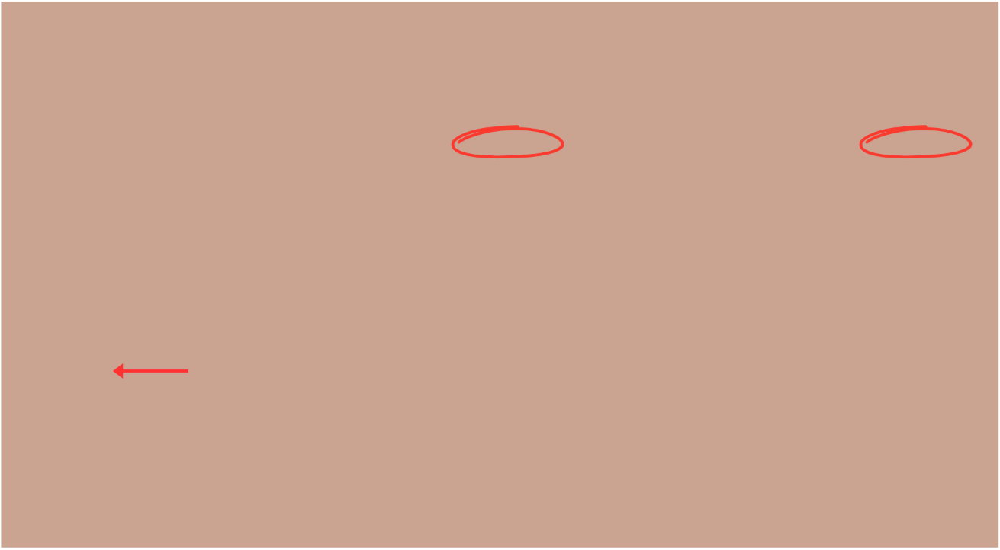
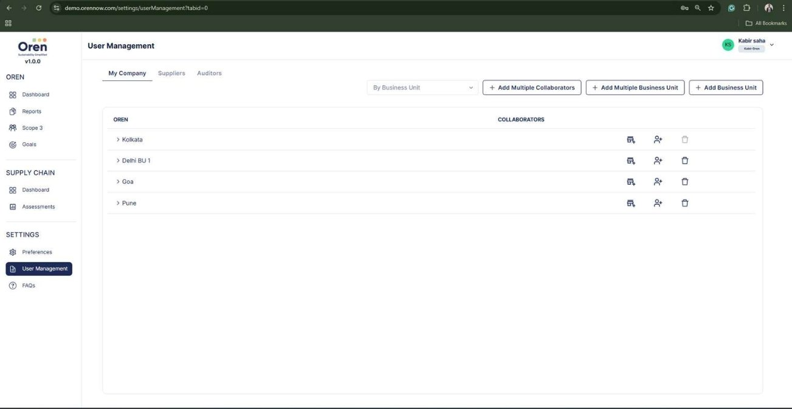
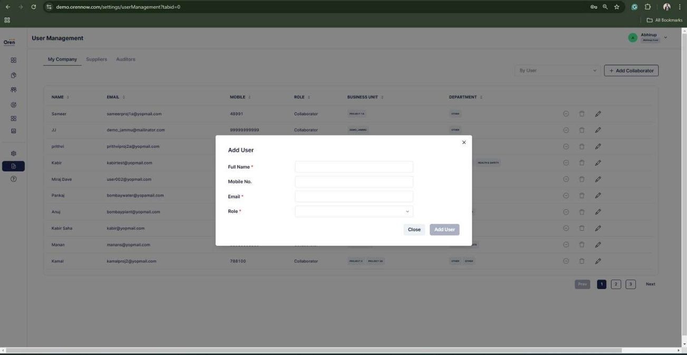

# Oren Product Documentation

## About Oren

Oren is a comprehensive sustainability platform dedicated to empowering businesses with the tools they need to achieve their sustainability goals. With decades of combined experience, Oren provides award-winning software solutions designed to simplify and automate your sustainability journey.

## Core Features

### Sustainability Reporting & Compliance

- **BRSR Reporting**: Create assurance-ready Business Responsibility and Sustainability Reports with zero hassle and zero delay
- **Multiple Framework Support**: Minimize data collection time across various global frameworks and custom reports
- **Digital Audit Trail**: Maintain complete traceability for any changes to sustainability data or reports
- **Auditor Integration**: Invite auditors for hassle-free digital audits

### ESG Data Management

- **Automated Data Collection**: Optimize ESG data collection through API integration, ensuring time efficiency and data accuracy
- **Team Collaboration**: Streamline collaboration across departments, locations, and business units
- **Value Chain Engagement**: Enhance collaboration with partners on sustainability initiatives using industry-specific roadmaps
- **In-built GHG Calculation**: Accurate accounting for Scope 1, 2, and 3 greenhouse gas emissions

## Solutions

### Regulatory Compliance
- **BRSR**: Comprehensive support for Business Responsibility and Sustainability Reporting
- **GRI**: Global Reporting Initiative framework support
- **CBAM**: Carbon Border Adjustment Mechanism compliance

### Sustainability Initiatives
- **Decarbonisation**: Tools to measure, manage and reduce carbon footprint
- **EcoVadis**: Support for EcoVadis sustainability rating platform
- **Supply Chain Sustainability**: Tools to track and improve sustainability across the entire value chain

## BRSR Compliance Details

### What is BRSR?
BRSR (Business Responsibility and Sustainability Reporting) is a framework introduced by the Securities and Exchange Board of India (SEBI) in 2021. It mandates the top 1,000 listed companies in India to disclose quantifiable metrics on sustainability-related factors.

The framework requires companies to respond to 140 questions, divided into:
- 98 essential indicators (mandatory)
- 42 leadership indicators (voluntary)

The disclosure requirements are grouped into nine core principles based on the National Guidelines for Responsible Business Conduct:

1. Conducting business with integrity, in an ethical, transparent and accountable manner
2. Providing sustainable and safe goods and services
3. Respecting and promoting employee well-being
4. Respecting stakeholder interests and being responsive
5. Respecting and promoting human rights
6. Respecting and promoting the environment
7. Engaging in responsible and transparent public policy advocacy
8. Promoting inclusive growth and equitable development
9. Engaging with and providing value to customers responsibly

### BRSR Core
BRSR Core represents a subset of the BRSR, consisting of a set of Key Performance Indicators (KPIs) across 9 ESG attributes, with compliance timelines:

- FY 2023-24: Top 150 listed entities must provide "reasonable assurance" on BRSR Core KPIs
- FY 2024-25: Top 250 listed entities must provide "reasonable assurance" on BRSR Core KPIs, including for their value chain
- FY 2025-26: Top 500 listed entities must provide "reasonable assurance" on BRSR Core KPIs, including for their value chain
- FY 2026-27: Top 1000 listed entities must provide "reasonable assurance" on BRSR Core KPIs, including for their value chain

## Support Resources

- **Blog**: Insights and guidance on sustainability practices at [Oren Blog](https://www.orennow.com/blogs)
- **Webinars**: Educational sessions and expert discussions
- **Case Studies**: Real-world implementation examples
- **Whitepapers**: In-depth analysis and best practices
- **Demo**: Schedule a personalized demonstration at [Oren Demo](https://www.orennow.com/schedule-demo)

## Contact Information

For more information about Oren's sustainability platform, please visit [www.orennow.com](https://www.orennow.com) or schedule a free BRSR consultation. 

**User Management**

The “User Management” option allows you to add multiple business units, users, and collaborators. From the dropdown menu, you can select either "By Business Unit" to add a Business Unit (BU) or "By User" to add and view users. ![ref1]

Empowering Sustainable Business Practices![ref2]

**What are Collaborators?**

Collaborators are users responsible for specific data ![ref3]for one or more business units (eg. Finance, Operations, HR data owners) 

**Data Assignees/Owners:** These are the data owners for energy, water, waste, HR, EHS data etc. across your plants or HO. 

**Data Reviewers:** These are the Department Heads or Plant Heads whose responsibility is to review and Accept/Reject the data provided by the data assignees/owners

**Add Collaborators**

Simply select By User ![ref3]from the drop down. 

And then click on the ‘Add Collaborators’ button ![ref1]

**Add Collaborators Deatils**

Add details on the new Pop-Up window - kindly make sure you add correct details here ![ref1]
Empowering Sustainable Business Practices![ref2]

[ref1]: Aspose.Words.10b0ebf0-a909-417a-8cf3-9ad3ada04410.004.png
[ref2]: Aspose.Words.10b0ebf0-a909-417a-8cf3-9ad3ada04410.005.png
[ref3]: Aspose.Words.10b0ebf0-a909-417a-8cf3-9ad3ada04410.007.jpeg

Sustainability Team (Admin User) FAQs

Profile Setup, Access & User Management
How do I set up my profile?
To set up your profile, click on the ‘Preferences’ tab in the navigation bar, then select ‘Personal Profile.’  to edit your personal details. You can also edit the company details in the  ‘Company Profile’ section. Also use the “preferences’ tab to also configure some basic settings. Doing these three steps will help you set up a proper profile in Oren Sustainability Hub (OSH).
What are the types of users on the platform? How do their roles and permissions differ?
Oren Sustainability Hub (OSH) supports three types of user roles, each with specific responsibilities:
Sustainability Team (Admin Role)
The Sustainability Team has full administrative control over Oren Sustainability Hub (OSH) . This includes user management (adding, editing, or removing users), as well as the ability to create, manage, and delete reports. They can monitor real-time progress, trigger notifications and reminders, and access detailed dashboards for performance tracking.
Collaborator
Collaborators are responsible for managing data within their respective departments or sub-business units. Oren Sustainability Hub (OSH) follows a maker-checker model, where collaborators act as "makers" who input data, while "checkers" are responsible for validating the accuracy and completeness of that data.
Auditor
Auditors are third-party stakeholders invited to the platform after the data collection and report creation processes are complete. Their role is to conduct a final validation of the data, ensuring its accuracy and completeness before final submission.

How do I set up my companies’ organisation boundary (Org-Tree/ Org Chart) 
To set up  your companies’ organisation boundary,  please click on the "User Management" button and navigate to the "My Company" section of Oren Sustainability Hub (OSH) . From there, you’ll need to add your company’s locations as business units and sub-business units. This should include all locations that fall within your current reporting or carbon accounting measurement boundary. Bulk Upload of the same through and excel (.csv) file is also available.
How do I assign roles and permissions to my team members?
Once the organisational boundary is defined based on your reporting boundary, the admin user can assign multiple collaborators as makers and checkers for each business unit or sub-business unit. Makers are responsible for entering data, while checkers validate the accuracy and completeness of that data.

Data Collection 
What is the maker-checker workflow?
The maker-checker model in Oren Sustainability Hub (OSH). ensures data integrity by designating data owners (makers) to submit data, while checkers validate it before it is used for reporting. Each data point or question on the platform is assigned both a maker and a checker for review and approval.
What is the data collection workflow in Oren Sustainability Hub (OSH)?
Each question in a report follows a specific data collection workflow, either on a Month-on-Month or Year-on-Year basis. The data collection type is clearly indicated when you click on the question. Some questions can be answered directly through the platform's user interface, while others may require bulk data uploads via a (.csv) file. For more exact guidance on the appropriate method of data collection for each question, please contact your project manager.
What is the frequency of data collection?
Each question in a report in Oren Sustainability Hub (OSH) follows a specific data collection workflow, which can be either on a Month-on-Month or Year-on-Year basis. The type of data collection is clearly indicated when you click on the question itself. For more exact guidance on the appropriate cadence of data collection for each question, please contact your project manager.
Can I edit data after submitting it?
Yes, a collaborator can edit the data at any time before it is submitted for admin review and approval. If the data has already been sent for approval, the admin must reject it in order for the data to be returned to the collaborator, who can then make the necessary edits.
How to save entered data? 

Yes, Oren Sustainability Hub (OSH) automatically saves any data entered by the user in real time. There’s no need to manually save your work; the platform will always reflect the most recent changes made.

Can I keep a user as both a maker and a checker?

Yes, Oren Sustainability Hub allows a user to be assigned both the maker and checker roles. However, only one role can be accessed at a time. While it's possible to open both roles in separate tabs, this is not recommended. If you need a user to have simultaneous access to both roles, you can either upgrade the user to an admin role or work with the ESG team for internal management. For further assistance, please contact your program manager.

How can I integrate data from external systems?
Yes, data stream integrations for upload are possible. However, this is a technical process that requires assistance from the Oren Sustainability Hub (OSH) tech team. For support, please contact your Project Manager.

Why has my response been highlighted as red?
Responses marked in red indicate that they have been rejected by the Admin during the approval process. To change the status to green, the data must be re-approved by the Admin. For support, please contact your Project Manager.
How do I track the progress of data collection?
You can use the "Progress Dashboard" to track real-time updates on data collection status, pending approvals, and validated data. This feature is available for specific reports, such as BRSR and GRI. For other reports, you will need to check the status on a question-by-question basis. For further assistance, please contact your Project Manager.
What type of supporting documents should I attach?
Each data point includes a "Guidance" icon that specifies the required supporting documents (e.g., utility bills, certificates, invoices). To upload these documents, collaborators can use the “document upload” icon located at the top right of each question tab.For further assistance, please contact your Project Manager.
How can I assign data points to other departments?
Each question has an "Assign Question" module that allows you to assign multiple collaborators across different business units. Once assigned, any changes in collaborators will automatically update the relevant departments as well.For further assistance, please contact your Project Manager.
What happens if a Collaborator does not submit data on time?
Automated reminders are sent to collaborators & admins for pending data submissions. Additionally, you can also manually trigger notifications to follow up on outstanding tasks or submissions. For further assistance, please contact your Project Manager.
Can I review the data on the dashboards on an annual and monthly basis?
Admins can  review data on an annual, quarterly, or monthly basis, either at the business unit level or by sub-business unit. For further assistance, please contact your Project Manager.
How do you add other hazardous and non-hazardous element waste in certain months?

For certain data types like these waste types mentioned above , a month-on-month data  entry is required since the start of the financial year, users must enter data for each relevant month. For months where no data is available, users should enter "0" to indicate no activity.For further assistance, please contact your Project Manager.

GHG Accounting FAQs 
What are the emission factors used for the purpose of GHG Accounting?
Oren Sustainability Hub (OSH) offers a comprehensive and up-to-date Emission Factor Library that covers all scopes (Scope 1, 2, and 3) and sub-scopes. The library includes multiple emission factors from trusted sources such as IPCC, DEFRA, EXIOBASE (3.9.4), the India GHG Program, and US-EPA. Users also have access to a detailed carbon accounting methodology document upon request to ensure alignment with the latest emissions standards.

How does Scope 1 emissions calculation work?

Oren Sustainability Hub (OSH) provides quantity-based emission factors for all types of fuels, refrigerants, and vehicles, sourced from the IPCC. These factors cover all three sub-scopes of GHG accounting—mobile combustion, fugitive emissions, and stationary combustion—representing the most widely accepted approach to GHG accounting globally.

How does Scope 2 emissions calculation work?
Oren Sustainability Hub (OSH) offers both spend-based and quantity-based emission factors for grid electricity usage, sourced from the Central Electricity Authority (CEA). This approach aligns with the most widely accepted GHG accounting standards globally.
How does Scope 3 emissions calculation work?
Oren Sustainability Hub (OSH) provides spend-based, quantity-based, and distance-based emission factors for all sub-scopes. The library includes emission factors from trusted sources, including IPCC, DEFRA, EXIOBASE (3.9.4), the India GHG Program, and US-EPA for Scope 3 emissions. This approach aligns with globally recognized GHG accounting standards.
Is it Oren’s responsibility to update the emission factors?
Oren Sustainability Hub (OSH) regularly updates its emission factors and the emission factor library across multiple fiscal years. The Carbon Accounting methodology document is also refreshed annually. Users will be notified of any updates to emission factors as soon as they are released. Additionally, the OSH team will update and migrate existing data to the latest version of the factors automatically.

Reporting Requirements
How do I create a new ESG report?
To generate a report, navigate to the "Reports" section and select your desired reporting framework (e.g., GRI, TCFD, BRSR). The system will automatically populate the relevant data fields. You can further customise the report format or add new fields as required.For further assistance, please contact your Project Manager.
What is a Custom Report?
A custom report in Oren Sustainability Hub (OSH) is a tailored report designed for organisations that do not follow standard frameworks like BRSR or GRI. It allows companies to create reports based on specific areas such as Scope 3, energy, waste, and other ESG-related topics / data , customised to their unique use cases. For assistance in creating or customising reports, please contact your Project Manager.
What are the reporting frameworks on Oren Sustainability Hub?
Oren Sustainability Hub (OSH) supports a range of up-to-date ESG reporting frameworks, including BRSR, GRI, CDP, TCFD, and various custom reports that align with current ESG reporting requirements. If you cannot find any specific report, please contact your Project Manager for assistance.

Can I customise reporting templates?
Yes, Oren Sustainability Hub (OSH) allows administrators to create custom reporting templates tailored to the specific needs of your organisation or to comply with new regulatory requirements. This flexibility enables you to design reports that capture relevant ESG data in a format that aligns with your unique reporting objectives. For assistance with building or customising templates, please reach out to your Project Manager.
How do I download my BRSR or GRI reports?
Oren Sustainability Hub (OSH) supports report downloads across multiple ESG frameworks, including GRI, CDP, BRSR, and more. Simply select your desired reporting framework from the "Reports" section, and the platform will automatically format the report according to the chosen standards. This ensures your data is aligned with the specific requirements of the selected framework, making the reporting process efficient and seamless.

Target setting Module 
How do I set sustainability targets?
Oren Sustainability Hub (OSH) offers a "Target Setting" feature that allows you to define and track your greenhouse gas (GHG) reduction goals, such as Science-Based Targets Initiative (SBTi) or Net Zero commitments. Once set, you can monitor progress towards these targets directly within the platform. The system automatically pulls relevant data from your company’s base data, including Scope 1, Scope 2, and Scope 3 emissions, which have already been collected within the platform, ensuring seamless integration and accurate tracking. Other relevant ESG metrics can also be configured and tracked. Please reach out to your Project Manager, for further assistance.

Collaborators FAQs

Profile Setup, Access & User Management
How do I set up my profile?
Collaborator accounts are created by the admin. While collaborators can update their basic preferences and personal details, they do not have the ability to edit other settings or configurations. For further assistance or changes to collaborator accounts, please contact your Project Manager.

Data Collection 
How do I submit my department’s data?
To enter and upload data in Oren Sustainability Hub (OSH), log in to your account and navigate to the "Data Collection" section. Once there, you will find fields assigned to you where you can input relevant data. You have the option to manually enter data or upload supporting documents, such as images, PDFs, or other files, directly into the platform. Simply use the document upload icon to attach files where necessary. This flexibility ensures that all data is captured accurately and in accordance with your reporting requirements.
What type of supporting documents should I attach?
Each data point includes a "Guidance" icon that specifies the required supporting documents (e.g., utility bills, certificates, invoices). To upload these documents, collaborators can use the “document upload” icon located at the top right of each question tab.For further assistance, please contact your Project Manager.
What if I am unsure about a data point?
For detailed instructions on how to enter data, simply click on the "Guidance" icon next to the relevant data field. This will provide you with step-by-step guidance to ensure accurate data entry. If you need further clarification or additional support, feel free to reach out to the Project Manager for assistance.
Can I edit data after submitting it? / How to edit data if approved?

Yes, Oren Sustainability Hub (OSH) automatically saves any changes you make to your data in real time, ensuring your entries are always up to date. There is no need to manually save your work; the platform automatically captures and reflects the most recent changes.After you submit your data for review, if any modifications are required, you can request the Admin to reject the submission within the approval flow. Once the data is rejected, it will be returned to you, allowing you to make necessary edits and resubmit it. This process ensures that you can always update and refine your data as needed before final approval.

What is the timeline for submitting my data?
Each data point within Oren Sustainability Hub (OSH) will have a specific submission deadline assigned by the Sustainability Team. To help you stay on track, automated notifications will be sent to remind you of any pending submissions as the deadline approaches. These reminders ensure that you are always informed and able to complete your data entry on time, helping streamline the reporting process.
What happens if there is an error in my data submission?
If the checker (validator) identifies an error in the data you submitted, they will flag the issue and return the data point to you for correction. You will receive a notification detailing the specific error and outlining what needs to be revised. This ensures that you can promptly address any issues and resubmit the corrected data for review.
How can I review the status of my submitted data?
To monitor the status of your data submission, navigate to the "Submission Status" dashboard. This dashboard provides an overview of whether your data is still pending, has been accepted, or has been rejected. It allows you to easily track the progress of your submissions, ensuring you stay informed about the current status and take necessary actions as needed.
Why has my response been highlighted as red?

Responses marked in red indicate that they have been rejected by the Admin during the approval process. To change the status to green, the data must be re-approved by the Admin. For further assistance, please contact your Project Manager.

How do I know if my data has been validated?
Once the checker (validator) reviews and validates your data, you will receive a notification informing you of the validation status. Additionally, you can always check the status of your data in the “Data Validation” section, where you can view whether your data has been successfully validated or if further action is required. For further assistance, please contact your Project Manager.
Is it possible to access both Maker and Checker from the same browser in the side-by-side tab?

Yes, Oren Sustainability Hub allows a user to be assigned both the maker and checker roles. However, only one role can be accessed at a time. While it's possible to open both roles in separate tabs, this is not recommended. If you need a user to have simultaneous access to both roles, you can either upgrade the user to an admin role or work with the ESG team for internal management. For further assistance, please contact your program manager.

Auditors FAQs

Profile Setup ,Access & User Management

How do I access the ESG data for auditing?
You will receive an invitation from the Sustainability Team (Admin role of the team)  to access Oren Sustainability Hub (OSH). Once you accept the invitation and log in to the platform, you will have access to all the data points assigned to you, along with any supporting documents that are relevant to your tasks. This allows you to view, edit, and submit the data as needed to contribute to the organisation’s sustainability efforts.
What is the scope of my access as an auditor?
As an auditor, you will have read-only access to all relevant data points and supporting documentation within Oren Sustainability Hub (OSH). This allows you to review and validate the data without the ability to edit or modify any information. Your role is to ensure that the data is accurate, complete, and aligned with the required ESG standards, providing an additional layer of verification to the reporting process.
How can I view the audit trail for a data point?
To view the complete history of a data point, including submission, validation, and any edits made, simply navigate to the "Audit Log" section under the relevant data point. The Audit Log provides a detailed record of each action taken on the data, including timestamps and the users involved in each step of the process. This feature ensures full transparency and allows you to track the progress and changes made to the data throughout its lifecycle.
Can I request additional information for a data point?
Yes, Oren Sustainability Hub (OSH) allows you to leave comments on any data point, enabling you to request additional clarification or documentation from the Sustainability Team. This feature ensures open communication and facilitates a smooth data review process, allowing you to address any questions or concerns directly within the platform.
How do I validate the GHG emissions calculations?
To validate GHG emissions calculations, you can review the comprehensive Emission Factor Library in OSH, which covers all scopes (Scope 1, 2, and 3) and sub-scopes. The library includes emission factors from trusted sources like IPCC, DEFRA, EXIOBASE, the India GHG Program, and US-EPA. Additionally, a detailed carbon accounting methodology document is available with us  to ensure calculations align with the latest emissions standards.
How do I ensure the data complies with reporting standards?
To verify compliance, each data point features a "Guidance" icon that outlines the required supporting documents and the underlying methodology for the answer (e.g., utility bills, certificates, invoices). Auditors can review both the requirements and the uploaded documents through the “Document Upload” icon in each question tab to ensure the data aligns with reporting standards.
Can I download the report on a quarter basis?

At the present moment in the Oren sustainability Hub (OSH) this feature is not available . For further assistance, please contact your program manager.

Can I export the data for offline review?
Yes, you can download all data in the report associated with each business unit and month via the Download Report -> Excel Detailed option from your reporting screen.

Suppliers FAQs
What is the data collection workflow in Oren Sustainability Hub (OSH)?
Each question in a supplier assessment  follows a specific data collection workflow, mostly on a Year-on-Year basis or one time activity basis the . The data collection type is clearly indicated when you click on the question. Some questions can be answered directly through the platform's user interface, while others may require bulk data uploads via a (.csv) file. For more exact guidance on the appropriate method of data collection for each question, please contact your project manager.

Can I edit data after submitting it?
Yes, a user from the supplier profile  can edit the data at any time before it is submitted for admin review and approval. If the data has already been sent for approval, the admin must reject it in order for the data to be returned to the collaborator, who can then make the necessary edits.
How to save entered data? 

Yes, Oren Sustainability Hub (OSH) automatically saves any data entered by the user in real time. There’s no need to manually save your work; the platform will always reflect the most recent changes made.
Why has my response been highlighted as red?
Responses marked in red indicate that they have been rejected by the Admin during the approval process. To change the status to green, the data must be re-approved by the Admin. For support, please contact your Project Manager.
How do I track the progress of data collection?
You can always view the progress of the assessment in the homepage of the platform & one can also check this to track real-time updates on data collection status, pending approvals, and validated data. This feature is available for specific assessments . For other reports/assessments , you will need to check the status on a question-by-question basis. For further assistance, please contact your Project Manager.
What type of supporting documents should I attach?
Each data point / question in the assessment  includes a "Guidance" icon that specifies the required supporting documents (e.g., utility bills, certificates, invoices). To upload these documents, value-chain partners / suppliers  can use the “document upload” icon located at the top right of each question tab.For further assistance, please contact your Project Manager.
What type of supporting documents should I attach?
Each data point includes a "Guidance" icon that specifies the required supporting documents (e.g., utility bills, certificates, invoices). To upload these documents, value-chain partners / suppliers can use the “document upload” icon located at the top right of each question tab.For further assistance, please contact your Project Manager.
What if I am unsure about a data point?
For detailed instructions on how to enter data, simply click on the "Guidance" icon next to the relevant data field. This will provide you with step-by-step guidance to ensure accurate data entry. If you need further clarification or additional support, feel free to reach out to the Project Manager for assistance.
Can I edit data after submitting it? / How to edit data if approved?

Yes, Oren Sustainability Hub (OSH) automatically saves any changes you make to your data in real time, ensuring your entries are always up to date. There is no need to manually save your work; the platform automatically captures and reflects the most recent changes.After you submit your data for review, if any modifications are required, you can request the Admin to reject the submission within the approval flow. Once the data is rejected, it will be returned to you, allowing you to make necessary edits and resubmit it. This process ensures that you can always update and refine your data as needed before final approval.

What is the timeline for submitting my data?
Each data point within Oren Sustainability Hub (OSH) will have a specific submission deadline assigned by the Sustainability Team. To help you stay on track, automated notifications will be sent to remind you of any pending submissions as the deadline approaches. These reminders ensure that you are always informed and able to complete your data entry on time, helping streamline the reporting process.
        11. What happens if there is an error in my data submission?
If the checker (validator) identifies an error in the data you submitted, they will flag the issue and return the data point to you for correction. You will receive a notification detailing the specific error and outlining what needs to be revised. This ensures that you can promptly address any issues and resubmit the corrected data for review.
         12. How can I review the status of my submitted data?
To monitor the status of your data submission, navigate to the homepage . This dashboard in this page  provides an overview of whether your data is still pending, has been accepted, or has been rejected. It allows you to easily track the progress of your submissions, ensuring you stay informed about the current status and take necessary actions as needed.
        13. How do I know if my data has been validated / Approved?
Once the checker (validator) reviews and validates your data, you will receive an email- notification informing you of the validation status. Additionally, you can always check the status of your data in the “Data Validation” section, where you can view whether your data has been successfully validated or if further action is required. For further assistance, please contact your Project Manager.
         14. How do I access the ESG Assessment to enter data ?
You will receive an invitation from the Sustainability Team (Admin role of the team)  to access Oren Sustainability Hub (OSH). Once you accept the invitation and log in to the platform, you will have access to all the data points & assessments  assigned to you, along with any supporting documents that are relevant to your tasks. This allows you to view, edit, and submit the data as needed to contribute to the organisation’s sustainability efforts.
        15. What is the scope of my access as a Supplier / Value Chain Partner?
As a Supplier / Value Chain Partner, , you will have limited write-only access to all relevant data points and supporting documentation within Oren Sustainability Hub (OSH). This allows you to review and submit  the data with the ability to edit or modify any information. Your role is to ensure that you enter the data that is accurate, complete, and aligned with the required ESG standards, providing an additional layer of verification to the reporting process.
        16. Where will my data be displayed / reflected on the platform?
As a Supplier/Value Chain Partner, you are required to submit specific ESF data within the Oren Sustainability Hub (OSH). This enables your vendor partner to review and assess the data, gaining insights into the progress of their supply chain sustainability program. Your responsibility is to ensure that the data you provide is accurate, complete, and compliant with the relevant ESG standards.
